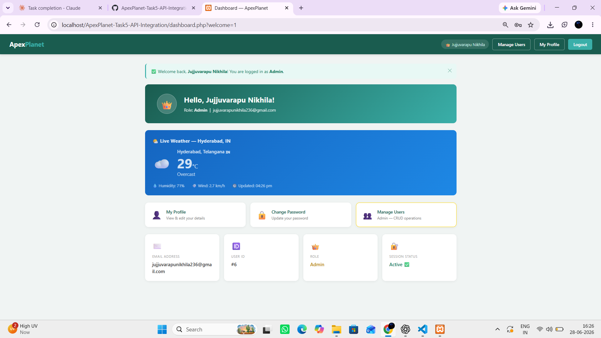
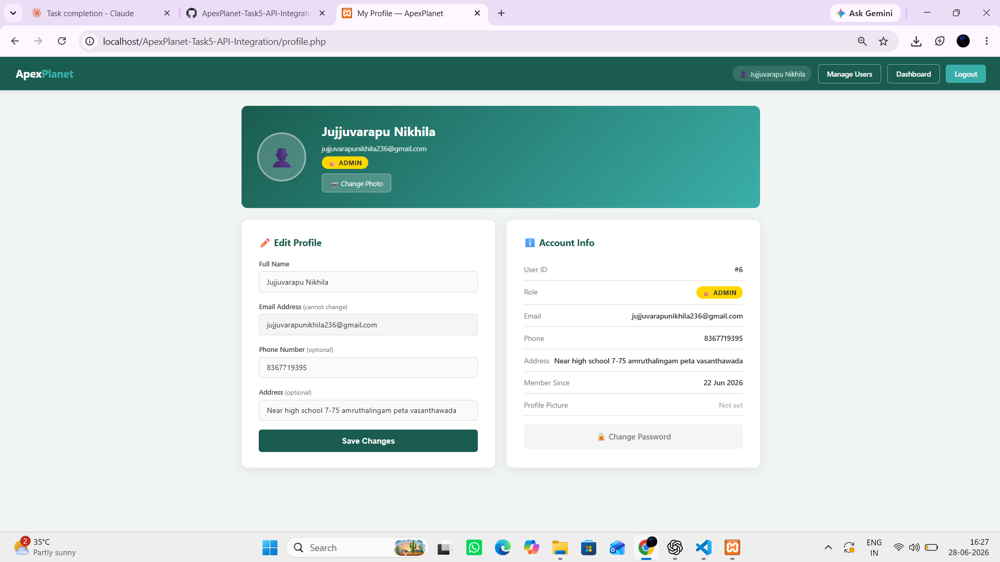
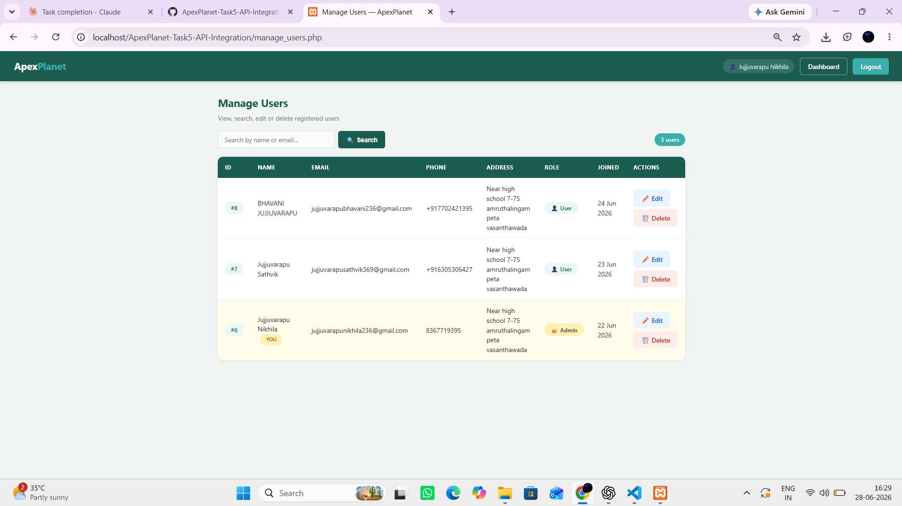
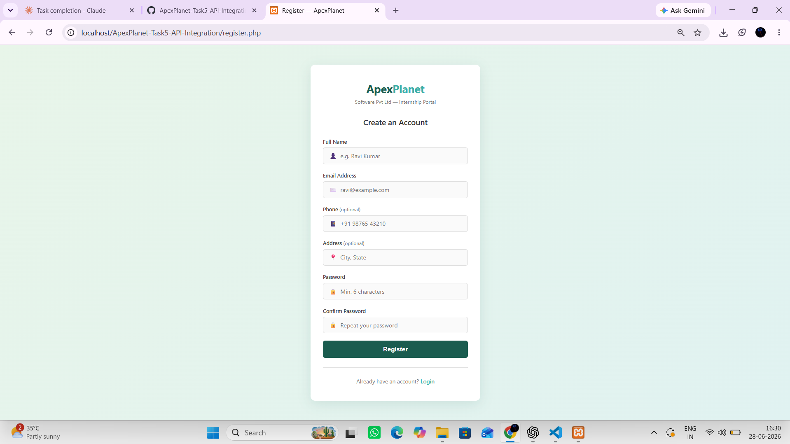
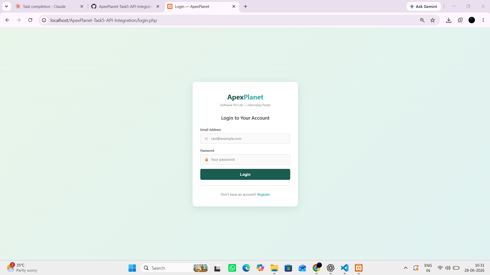
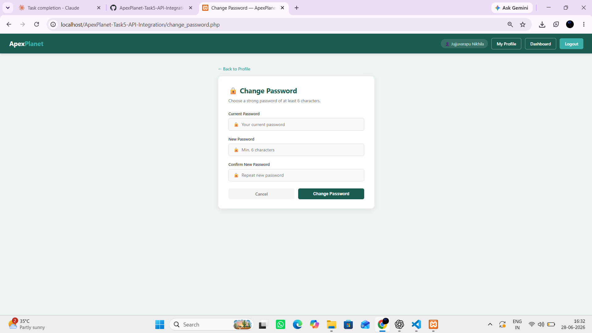

# ApexPlanet-Task5-Advanced-Features-Finalization

A fully featured PHP & MySQL web application with **advanced features and final polish** — built as part of the **ApexPlanet Software Pvt. Ltd. 30-Day Web Development Internship (Task 5)**. Final task — builds on Tasks 1–4.

---

## 🛠 Tech Stack


- PHP 8+ (PDO, file uploads, sessions)
- MySQL
- CSS3 (shared stylesheet from Task 4)
- JavaScript (Fetch API for weather, client-side validation)
- Open-Meteo API (free weather API — no key required)
- XAMPP / WAMP

---

## 📁 Project Structure

```
task5/
├── style.css              # Shared stylesheet (Task 4)
├── db.php                 # PDO + role helper functions
├── setup.sql              # Schema with role & avatar columns
├── register.php           # Registration (first user = admin)
├── login.php              # Login — stores role in session
├── dashboard.php          # Dashboard + Live Weather API widget
├── profile.php            # Profile management + avatar upload
├── change_password.php    # Change password
├── manage_users.php       # Admin-only CRUD
├── edit_user.php          # Admin-only edit user
├── delete_user.php        # Admin-only delete user
├── logout.php             # Secure logout
├── uploads/               # Profile picture uploads folder
└── README.md
```

---

## ⚙️ Setup Instructions

### 1. Install XAMPP / WAMP
Start **Apache** and **MySQL**.

### 2. Place the project
- **XAMPP:** `C:/xampp/htdocs/ApexPlanet-Task5-Advanced-Features/`
- **WAMP:**  `C:/wamp64/www/ApexPlanet-Task5-Advanced-Features/`

### 3. Create the Database
Run `setup.sql` in phpMyAdmin.

> ⚠️ If upgrading from Task 4, run only the two `ALTER TABLE` lines at the bottom of `setup.sql`.

### 4. Configure credentials
```php
// db.php
define('DB_USER', 'root');
define('DB_PASS', '');
```

### 5. Run
```
http://localhost/ApexPlanet-Task5-Advanced-Features/register.php
```
> The **first user to register becomes Admin automatically**.

---

## 🚀 Task 5 Features

### ✅ 1. User Roles & Permissions

| Feature | Detail |
|---|---|
| Role column | `ENUM('admin','user')` in users table |
| Auto admin | First registered user gets `admin` role automatically |
| `isAdmin()` | Helper function in `db.php` checks `$_SESSION['user_role']` |
| `requireAdmin()` | Guards `manage_users.php`, `edit_user.php`, `delete_user.php` |
| Role badge | Dashboard and manage users table show 👑 Admin / 👤 User badges |
| Role in session | `$_SESSION['user_role']` stored on login |
| Nav difference | Admin sees "Manage Users" button; regular users do not |

### ✅ 2. Profile Management (`profile.php`)

- View all account details (name, email, phone, address, role, member since)
- Edit name, phone, address
- Upload profile picture (JPG/PNG/GIF/WebP, max 2MB)
- Avatar auto-saves to `uploads/` folder, old file deleted on replace
- Profile picture shows in dashboard welcome card and navbar
- Link to `change_password.php` for secure password update

### ✅ 3. API Integration — Live Weather Widget

Uses **Open-Meteo** (completely free, no API key needed):
```
https://api.open-meteo.com/v1/forecast?latitude=17.3850&longitude=78.4867
&current=temperature_2m,relative_humidity_2m,wind_speed_10m,weather_code
&timezone=Asia/Kolkata
```

Displays on the dashboard:
- 🌡️ Current temperature (°C)
- ☁️ Weather condition (mapped from WMO weather codes)
- 💧 Humidity %
- 💨 Wind speed (km/h)
- 🕒 Last updated time

Handles errors gracefully — shows friendly message if API is unreachable.

### ✅ 4. Testing & Documentation

- All features tested manually in XAMPP
- Error handling with `try-catch` on all DB operations
- Input validation: client-side (JS) + server-side (PHP)
- SQL injection prevention via PDO prepared statements
- File upload validation (type, size)
- Role-based access control tested for both admin and user roles

---

## 📸 Screenshots

### Dashboard — Weather API + Role Badge


### Profile Page — Avatar Upload


### Manage Users — Admin Only (with Role column)


### Register Page


### Login Page


### Change Password


---

## 🔐 Security Summary

| Feature | Implementation |
|---|---|
| Passwords | `password_hash(PASSWORD_BCRYPT)` + `password_verify()` |
| SQL Injection | PDO named prepared statements throughout |
| XSS | `htmlspecialchars()` on all output |
| Session fixation | `session_regenerate_id(true)` on login |
| Secure logout | 3-step: clear vars, delete cookie, destroy session |
| Role enforcement | `requireAdmin()` on all admin pages |
| File uploads | Type whitelist + 2MB size limit + randomised filename |
| Error logging | Real errors → `error_log()`, friendly message → user |

---

## 👨‍💻 Author

**Name:** Abdul Basith
**Internship at:** ApexPlanet Software Pvt. Ltd.
**Program:** Web Development — PHP & MySQL (30 Days)
**Task:** Task 5 — Advanced Features and Finalization
